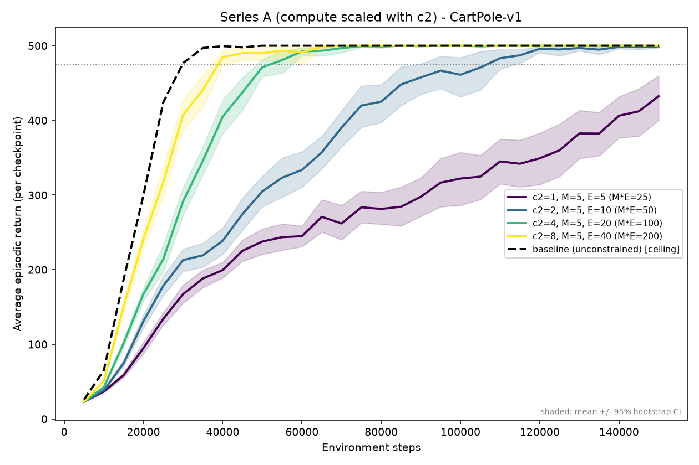
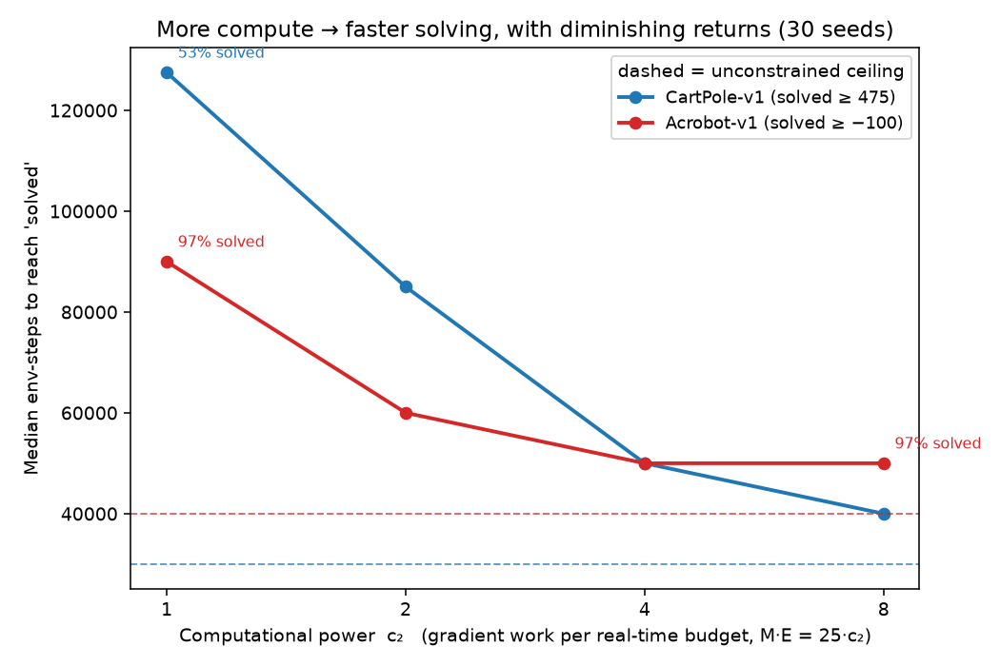

# PPO under real-time computational constraints

*RL when the environment doesn't wait for the agent: a bounded-compute PPO agent acts on a stale policy while each update computes, discarding the experience it's too busy to process. Does extra compute buy more epochs, or more fresh data?*

## How it works

Computing one PPO update (a "burst") takes wall-clock time

```
L = H·c·τ / c₂          with   H = 4·(C/N)·M·E
```

| symbol | definition |
|---|---|
| `c₂` | **computational power** - the impact variable; larger = faster machine |
| `H`  | forward/backward passes in one burst |
| `C`  | replay-buffer capacity, in samples (here `C = T`) |
| `T`  | environment steps between two consecutive bursts |
| `N`  | minibatches the buffer holds, `= C / batch_size` |
| `M`  | minibatches used per epoch (`M ≤ N`) |
| `E`  | epochs per burst |
| `batch_size` | minibatch size |
| `τ`  | wall-clock duration of one environment step |
| `c`  | fixed cost constant |

That burst takes `⌊L/τ⌋ = ⌊H·c / c₂⌋` environment steps to compute.
The env doesn't pause, so the agent must keep acting during that window, and two things follow:

1. **Stale policy:** The new parameters aren't deployed until the burst finishes (at step `t + ⌊L/τ⌋`); until then the agent acts on the old policy.
2. **Dropped experience:** The samples gathered while the learner is busy can't be used by it, so they are discarded.

Modelling **#2** (not just #1) is what makes `c₂` crucial here: each burst learns on only `T − ⌊L/τ⌋` of the `T` samples gathered since the last update. More power → smaller busy window → less wasted experience (see `train_ppo.py`).

## Results

*CartPole: mean ± 95% bootstrap CI. Acrobot: median ± IQR (a few seeds diverge). 30 seeds each.
Regenerate with `bash make_figures.sh` and `uv run python summary_figure.py`.*

**More compute → faster, more stable learning.**
On CartPole-v1, giving `c₂` more gradient work (`M·E = 25·c₂`) speeds up learning and shrinks seed variance toward the unconstrained ceiling.



| `c₂` (E) | median steps to solve (≥475) | seed std of final return |
|---|---|---|
| 1 (E=5)  | 127.5k *(53% of seeds solve)* | 73.0 |
| 2 (E=10) | 85k  | 5.8 |
| 4 (E=20) | 50k  | 0.8 |
| 8 (E=40) | 40k  | 0.0 |
| unconstrained | 30k | 0.0 |

The benefit **diminishes past `c₂ ≈ 4`** and is task-dependent.
On the harder Acrobot-v1 every budget eventually solves and the largest one (`c₂=8`) gives no further speed-up.



**Spend the budget on epochs or data?**
On CartPole it doesn't matter - everything saturates.
On Acrobot the typical run is also insensitive to the split, but pushing the budget into many epochs over a tiny batch (`M=2`, up to `E=50`) raises instability: ~1 in 30 seeds diverges, versus 100% solved for balanced splits.

## Setup (uv + Python 3.12)

```bash
uv sync                 # create .venv from pyproject.toml
```

Prefix commands with `uv run` to use the environment.

## Run

```bash
# one seeded run
uv run python train_ppo.py --env-name CartPole-v1 --constrained \
    --C 2000 --T 2000 --batch-size 100 --M 5 --E 10 \
    --c 0.1 --tau 40 --c2 2 --num-steps 150000 --checkpoint 5000 --seed 0

# a full sweep (one config dir per c₂ / allocation), then figures + tables
for s in seriesA_cartpole seriesA_acrobot seriesB_cartpole seriesB_acrobot; do
  uv run python run_experiment.py config/$s.json --n-runs 30 --n-proc 10 --root-dir results
done
bash make_figures.sh
```

Each run writes `<out_dir>/<seed>.txt` (row 0 = checkpoint steps, row 1 = average return), a saved model, and `stats.txt`.
Re-running with more `--n-runs` reuses existing seeds and skips finished runs.

## Experiments

All configs fix `C = T = 2000`, `batch_size = 100` (`N = 20`), `c = 0.1`, `τ = 40`, `ε = 0.2`, `γ = 0.99`, `λ = 0.95`, 2×64 tanh networks, and a constant 50% busy window (`⌊L/τ⌋ = 1000`).

- **Series A - does more power help?** Fix `M = 5` and scale work with compute: `M·E = 25·c₂` (`E = 5·c₂`), for `c₂ ∈ {1,2,4,8}`.
- **Series B - epochs vs. data?** Keep the same budget `M·E = 25·c₂` and vary the split with `M ∈ {10,5,2}`, for `c₂ ∈ {2,4}`.

Both include an unconstrained `baseline` (the ceiling), and Series A's `M=5` rows are Series B's middle column, so they form one grid. Configs live in `config/series{A,B}_{cartpole,acrobot}.json`.
