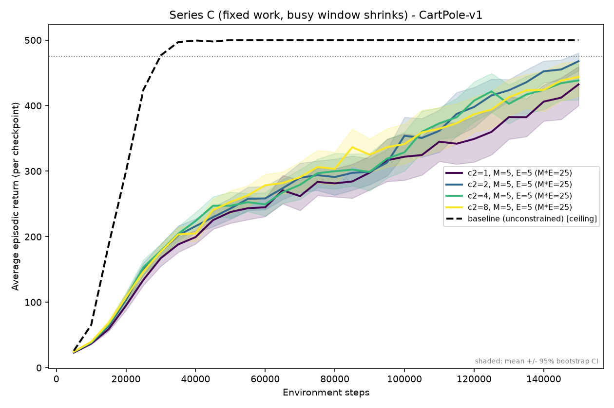
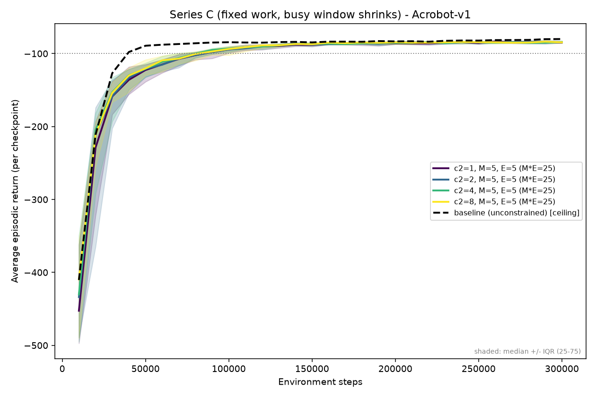

# Series C - staleness / data-drop sweep (`c₂` at fixed work)

Tracks Linear issue **AET-34**.

## Impact variable

Staleness / data-drop fraction: sweep `c₂` while holding gradient work fixed.

## Rationale

Isolate the real-time penalty itself, which Series A/B never test alone.
Fix `M = 5, E = 5` so gradient work `M·E = 25` is constant, then sweep `c₂`.
The busy window shrinks while the amount of learning stays fixed, so any effect is attributable purely to fresher, less-dropped data.
This is the direct complement to Series A: the two share the `c₂ = 1` point, then A adds epochs (`E = 5·c₂`) while this series holds them fixed, so the A-minus-C gap decomposes the compute benefit into "more gradient work" vs "less staleness".

## Design matrix

Fixed: `C = T = 2000`, `batch_size = 100`, `c = 0.1`, `tau = 40`, `M = 5`, `E = 5`.
Plus an unconstrained `baseline` ceiling.

| `c₂` | M | E | busy_steps `= ⌊1000/c₂⌋` | usable | drop fraction |
|---|---|---|---|---|---|
| 1 | 5 | 5 | 1000 | 1000 | 50% |
| 2 | 5 | 5 | 500 | 1500 | 25% |
| 4 | 5 | 5 | 250 | 1750 | 12.5% |
| 8 | 5 | 5 | 125 | 1875 | 6.25% |

All rows satisfy `busy_steps ≤ T`, `M·batch_size = 500 ≤ usable`, `M = 5 ≤ N = 20`.

## Expected outcomes

Larger `c₂` gives modest gains in stability and steps-to-solve from the smaller busy window, but smaller than Series A's gains at the same `c₂` (A also adds epochs).
Likely: on CartPole the effect is small (even 50% dropping is tolerable), while on data-hungry Acrobot reducing dropped experience matters more.
If A's advantage over this series is large, it implies Series A's improvement is driven mainly by extra gradient work, not by the shrinking window.

## Results

30 seeds per config on both environments.
Confirmed: with gradient work held fixed, shrinking the busy window (50% → 6% dropped) buys almost nothing.
Every constrained budget plateaus far below the unconstrained ceiling, and the `c₂ = 1` point matches Series A exactly - so Series A's speedup comes from the extra epochs, not from fresher data.




CartPole, at matched `c₂` (Series C vs the Series A anchor, which scales work as `M·E = 25·c₂`):

| `c₂` (busy window) | Series A steps@solve (%solved, std) | Series C steps@solve (%solved, std) |
|---|---|---|
| 1 (50% dropped)   | 127.5k (53%, 73) | 127.5k (53%, 73) |
| 2 (25% dropped)   | 85k (100%, 5.8)  | 125k (93%, 32) |
| 4 (12.5% dropped) | 50k (100%, 0.8)  | 120k (70%, 69) |
| 8 (6% dropped)    | 40k (100%, 0.0)  | 125k (77%, 74) |

Acrobot is flat across `c₂` (all ≈ -84.4 median return, ~90k steps to solve, 93-97% solved).

The figures above are the tracked copies in `assets/`; the `analyze --save` step below writes the originals to the gitignored `figures/`, from where they are copied into `assets/` for embedding.

## Run

```bash
# CartPole (30 seeds, 10 parallel)
uv run python -m ppo_study.run_experiment experiments/seriesC/config/cartpole.json \
    --n-runs 30 --n-proc 10 --root-dir experiments/seriesC/results/cartpole
# Acrobot
uv run python -m ppo_study.run_experiment experiments/seriesC/config/acrobot.json \
    --n-runs 30 --n-proc 10 --root-dir experiments/seriesC/results/acrobot

# Figures + summary tables
uv run python -m ppo_study.analyze experiments/seriesC/results/cartpole \
    --title "Series C - CartPole-v1" --threshold 475 \
    --save experiments/seriesC/figures/cartpole.png
uv run python -m ppo_study.analyze experiments/seriesC/results/acrobot \
    --title "Series C - Acrobot-v1" --threshold -100 --robust \
    --save experiments/seriesC/figures/acrobot.png

# Copy the published figures into the tracked assets/ dir (embedded in Results above)
cp experiments/seriesC/figures/cartpole.png assets/seriesC_cartpole.png
cp experiments/seriesC/figures/acrobot.png  assets/seriesC_acrobot.png
```

Outputs (`results/`, `figures/`) are gitignored; only `config/` and this README are tracked.
